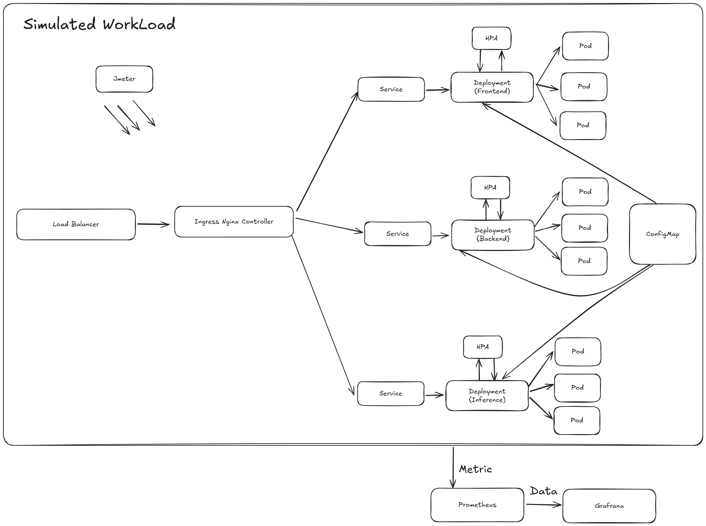

# Running the Cluster with Minikube
Follow the steps below to set up and run the Kubernetes cluster locally using Minikube.

## 1. Start the Minikube Cluster
```bash
minikube start
```
## 2. Enable the Ingress Add-on
```bash
minikube addons enable ingress
```
## 3. Enable the Metrics Server Add-on
```bash
minikube addons enable metrics-server
```
## 4. Deploy Application Components
From the `deployment` directory, apply all Kubernetes manifests:
```bash
kubectl apply -f .
```
## 5. Create Minikube Tunnel
This exposes LoadBalancer services to your local machine:
```bash
minikube tunnel
```
## 6. Setup Hosts File
Add the appropriate host entries in your local machine's hosts file to map the service domain, e.g.:
```bash
127.0.0.1 dev.local
```
## 7. Add Prometheus Helm Repository
```bash
helm repo add prometheus-community https://prometheus-community.github.io/helm-charts
helm repo update
```
## 8. Install Prometheus Stack with Helm
```bash
helm install monitoring prometheus-community/kube-prometheus-stack
```
## 9. Access Prometheus
You can either port-forward or expose Prometheus service externally to query metrics:
```bash
kubectl port-forward svc/monitoring-kube-prometheus-prometheus 9090:9090
```
Then access Prometheus at: [http://localhost:9090](http://localhost:9090)

Once the tunnel is running and hosts are set, the main application will be accessible at:
[http://dev.local](http://dev.local)

# Project Structure
